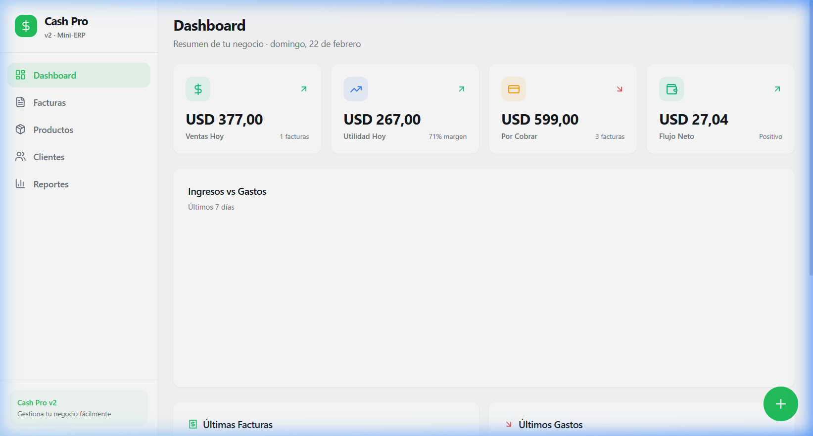
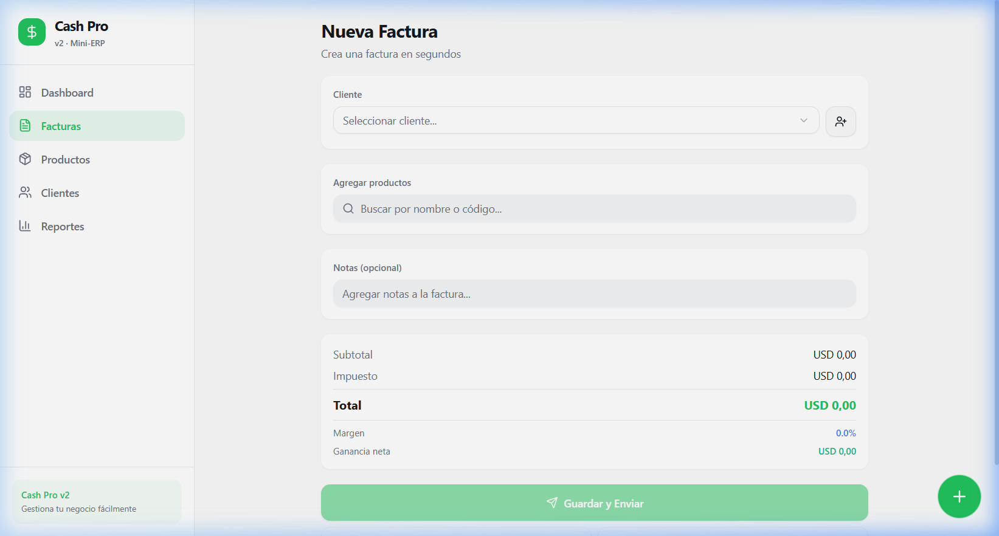

<p align="center">
  
  
  
  
  
</p>

# 💰 Cash Pro v2

> **Mini-ERP con UX tipo Uber/Rappi para pequeños negocios.** Factura rápido, controla tu inventario, rastrea clientes y sabe cuánto ganas realmente — todo desde una sola app.

---

## ✨ Características principales

| Módulo | Descripción |
|--------|-------------|
| 📊 **Dashboard** | KPIs en tiempo real: ventas del día, utilidad bruta, cuentas por cobrar y flujo de caja neto. Gráfico de ingresos vs gastos (últimos 7 días). |
| ⚡ **Facturación rápida** | Crea facturas en <30 segundos. Búsqueda de productos, cálculo automático de subtotal, impuestos, total, margen % y ganancia neta. |
| 📦 **Productos e inventario** | CRUD completo con precio compra/venta, margen calculado, alertas de stock bajo y filtros (todos, activos, stock bajo). |
| 👥 **Clientes** | Gestión de clientes con historial de facturas y resumen de cuentas por cobrar por cliente. |
| 💳 **Pagos** | Estados de factura (pendiente, parcial, pagada, vencida). Registro de pagos parciales y totales con método de pago. |
| 📈 **Reportes** | Estado de resultados (P&L) por rango de fechas, flujo de efectivo acumulado y márgenes bruto/neto. |

## 🖼️ Screenshots

<table>
  <tr>
    <td align="center"><strong>Dashboard</strong></td>
    <td align="center"><strong>Nueva Factura</strong></td>
  </tr>
  <tr>
    <td></td>
    <td></td>
  </tr>
</table>

## 🛠️ Tech Stack

```
Frontend        Next.js 14 (App Router) + TypeScript
Estilos         Tailwind CSS + shadcn/ui (18 componentes)
Estado          Zustand (persistido en localStorage)
Gráficos        Recharts
Iconos          Lucide React
Utilidades      date-fns, clsx, class-variance-authority
```

### 🗺️ Roadmap (futuro)

```
Backend         Hono.js (TypeScript, edge-ready)
Base de datos   PostgreSQL + Drizzle ORM
Autenticación   Clerk con Organizations (multi-empresa)
PDFs            @react-pdf/renderer
Storage         Cloudflare R2 (S3-compatible)
Móvil           React Native / Capacitor
Offline         Service Worker + IndexedDB
```

## 🚀 Instalación

```bash
# 1. Clonar el repositorio
git clone https://github.com/tinychef/cash-pro-v2.git
cd cash-pro-v2

# 2. Instalar dependencias
npm install

# 3. Ejecutar en desarrollo
npm run dev
```

Abre [http://localhost:3000](http://localhost:3000) en tu navegador.

## 📁 Estructura del proyecto

```
src/
├── app/
│   ├── page.tsx              # Dashboard
│   ├── layout.tsx            # Layout raíz + SEO
│   ├── globals.css           # Tema, animaciones, utilidades
│   ├── products/page.tsx     # CRUD Productos
│   ├── clients/page.tsx      # CRUD Clientes
│   ├── invoices/
│   │   ├── page.tsx          # Lista de facturas + pagos
│   │   └── new/page.tsx      # Facturación rápida
│   └── reports/page.tsx      # P&L + Flujo de caja
├── components/
│   ├── app-shell.tsx         # Sidebar + Bottom Nav + FAB
│   └── ui/                   # 18 componentes shadcn/ui
└── lib/
    ├── types.ts              # Interfaces TypeScript
    ├── store.ts              # Zustand store + datos demo
    ├── format.ts             # Formateo: moneda, %, fechas
    └── utils.ts              # cn() helper (Tailwind merge)
```

## 🎨 Diseño

- **UX tipo Uber/Rappi**: Pocas pantallas, botones grandes, flujos simples
- **Responsive**: Sidebar en desktop, bottom navigation en móvil
- **FAB flotante**: Botón "Nueva Venta" siempre visible con animación pulse
- **Tema premium**: Acento verde (#16a34a), bordes suaves, glassmorphism
- **Datos de demo**: 6 productos, 4 clientes, 5 facturas y gastos precargados

## 📜 Scripts disponibles

| Comando | Descripción |
|---------|-------------|
| `npm run dev` | Servidor de desarrollo (localhost:3000) |
| `npm run build` | Build de producción |
| `npm run start` | Servidor de producción |
| `npm run lint` | Verificar código con ESLint |

## 📄 Licencia

MIT © [tinychef](https://github.com/tinychef)
